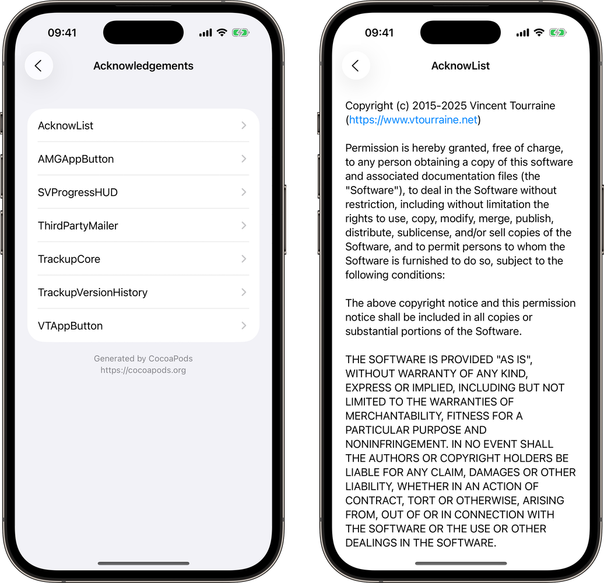

# AcknowList

Acknowledgements screen displaying a list of licenses, for example from [CocoaPods](https://cocoapods.org) dependencies.


[](https://travis-ci.org/vtourraine/AcknowList)

[](https://cocoapods.org/pods/AcknowList)
[](https://github.com/vtourraine/AcknowList/raw/master/LICENSE)

_Also available in Objective-C with [VTAcknowledgementsViewController](https://github.com/vtourraine/VTAcknowledgementsViewController)._



## Features

- Automatically load acknowledgments from CocoaPods-generated file
- Remove unnecessary line breaks from licenses for better text wrapping
- Optional list header and footer
- Tappable links in header, footer, and acknowledgment text
- Storyboard support
- Dark Mode support
- Dynamic Type support
- Localized in 13 languages
- UIKit and SwiftUI interfaces

## Installation

### CocoaPods

1. Add `pod 'AcknowList'` to your `Podfile`.
2. Run `pod install`.
3. Add the `Pods-#target#-acknowledgements.plist` file generated by CocoaPods to your main target: drag and drop the file from the `Pods/Target Support Files/Pods-#target#/` folder in your Xcode project (don’t copy the file, leave `Copy items if needed` unchecked).

### Swift Package Manager

AcknowList can be installed with the [Swift Package Manager](https://swift.org/package-manager/) (requires Xcode 12 for localized resources).

1. Click on `File` → `Swift Packages` → `Add Package Dependency…`.
2. Enter `https://github.com/vtourraine/AcknowList`.
3. Select the version you’d like to use.

## Initialization

The `AcknowListViewController` instance is usually pushed to an existing `UINavigationController`.

``` swift
let viewController = AcknowListViewController()
navigationController.pushViewController(viewController, animated: true)
```

By default, the controller will try to guess the name of your `.plist` file, based on the bundle name (`Pods-#bundle-name#-acknowledgements.plist`). If that doesn’t match the file you’re looking for, you can initialize the view controller with a custom file name or path.

``` swift
let viewController = AcknowListViewController(fileNamed: "Pods-AcknowExample-acknowledgements")
```

``` swift
let path = Bundle.main.path(forResource: "Pods-AcknowExample-acknowledgements", ofType: "plist")
let viewController = AcknowListViewController(plistPath: path)
```

If you want to include licenses that are not part of a `.plist` file, you can create new `Acknow` instances, and use them for the acknowledgements array of the controller.

``` swift
let acknow = Acknow(title: "...", text: "...")
let viewController = AcknowListViewController(acknowledgements: [acknow])
```

## Customization

The controller can also display a header and a footer. By default, they are loaded from the generated `plist` file, but you can also directly change the properties values.

``` swift
viewController.headerText = "We love open source software."
viewController.footerText = "Powered by CocoaPods.org"
```

The controller title is a localized value for “acknowledgements”. You might want to use this localized value for the button presenting the controller.

``` swift
button.setTitle(AcknowLocalization.localizedTitle(), for: .normal)
```

By default, `AcknowListViewController` uses the “grouped” table view style. You can choose a different style:

``` swift
let viewController = AcknowListViewController(plistPath: path, style: .plain)
```

If you need to further customize the appearance or behavior of this library, feel free to subclass its classes.

## SwiftUI

AcknowList now offers a SwiftUI interface, which supports all the major platforms.

Instantiate a `AcknowListSwiftUIView` with a path to the `plist` file, or with an array of `Acknow` instances, and present this view from a `NavigationView`.


## Platforms

| Platform | UIKit | SwiftUI |
|:--|:--|:--|
| 📱 | iOS 9.0+ | iOS 13.0+ |
| 📺 | tvOS 9.0+ | tvOS 13.0+ |
| ⌚️ | *not supported* | watchOS 7.0+ |
| 💻 | *not supported* | macOS 10.15+ |

## Requirements

AcknowList is written in Swift 5, and requires Xcode 12 and above.

## Credits

AcknowList was created by [Vincent Tourraine](https://www.vtourraine.net), and improved by a growing [list of contributors](https://github.com/vtourraine/AcknowList/contributors).

## License

AcknowList is available under the MIT license. See the `LICENSE.txt` file for more info.
